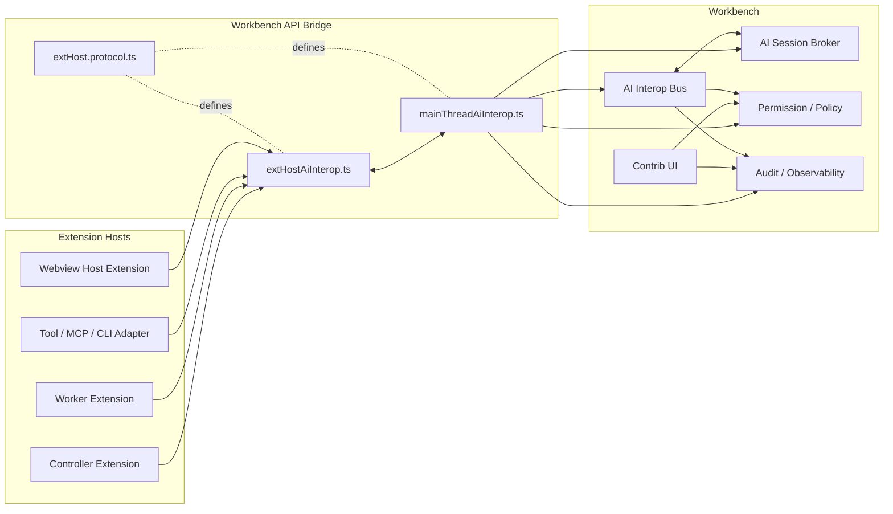

# AI Interop 平台能力：核心架构设计

## 1. 设计目标

本架构的目标是为 IDE 内多个 AI 扩展 / Agent / UI / CLI 提供一个可信协作平面，使平台能够：

- 统一管理端点注册与发现；
- 支持流式调用与消息路由；
- 支持会话、参与者、上下文与状态管理；
- 支持权限控制与用户授权；
- 支持审计、调试、性能观测；
- 与 VS Code 既有 MainThread / ExtHost / RPC 架构兼容。

## 2. Code - OSS 当前核心模块分层

### 2.1 `src/vs`

`src/vs` 是 VS Code / Code - OSS 内核源码主目录，内部按平台层、编辑器层、工作台层、扩展 API 层等进行分层组织。

### 2.2 `src/vs/workbench`

`workbench` 是桌面 IDE 主框架所在层，负责承载编辑器、面板、视图、状态栏、菜单、聊天入口、调试入口等平台级 UI 与服务。

### 2.3 `src/vs/workbench/services`

该目录存放工作台级服务，是最适合承载无 UI 业务内核的地方。AI Interop Bus、Session Broker、Policy、Audit 核心能力应该以 service 的形式放在这里。

### 2.4 `src/vs/workbench/contrib`

该目录存放工作台功能贡献点与 UI 相关实现。权限弹窗、审计面板、调试视图、命令入口等应放在这里。

### 2.5 `src/vs/workbench/api`

该目录是 Workbench 与 Extension Host 之间的 API 桥接层，包含：

- `browser/`：主线程侧 customer 实现；
- `common/`：ExtHost 侧对象、API 装配、RPC shape 定义。

### 2.6 Extension Host

Extension Host 是扩展运行时隔离环境。普通扩展运行在 Extension Host 中，通过 RPC 与主线程通信。扩展不能直接访问主界面 DOM，也不能直接操作其他扩展内部状态。

### 2.7 Main Thread / Workbench / RPC

VS Code 的官方模式是：

- 扩展运行在 ExtHost；
- Workbench 主线程持有平台真相；
- MainThread customer 接收来自扩展的调用；
- ExtHost 对象接收来自主线程的回调；
- 双方通过 `extHost.protocol.ts` 中定义的 shape 与 DTO 通信。

AI Interop 必须遵守这一架构风格，而不是自造一套旁路通道。

## 3. 架构总览

平台采用五层模型：

1. AI Interop Bus
2. AI Session Broker
3. Capability / Permission Layer
4. Adapter Layer
5. Observability / Audit Layer

其中：

- **Workbench services** 承担内核状态与编排；
- **MainThread / ExtHost API bridge** 承担平台与扩展之间的 RPC 边界；
- **Workbench contrib** 承担权限弹窗、审计面板与调试入口。

## 4. 模块职责

### 4.1 AI Interop Bus

职责：

- endpoint 注册与注销；
- invocation 路由；
- chunk 流式转发；
- cancel / timeout / backpressure；
- 调用级事件分发。

总线不理解“业务编排”，只理解通信与生命周期。

### 4.2 AI Session Broker

职责：

- session 创建、销毁、恢复；
- participant 管理；
- invocation 与 turn 关联；
- session ACL 与共享范围；
- orphaned / failed / canceled 管理；
- 持久化摘要与恢复点。

### 4.3 Capability / Permission Layer

职责：

- 扩展能力声明校验；
- 跨扩展调用授权；
- 会话上下文共享粒度控制；
- 工具/CLI/MCP 高风险审批；
- remoteAuthority / hostKind 策略判断。

### 4.4 Adapter Layer

职责：

- 把 commands、chat participant、tool、MCP、webview、CLI 统一投影成 endpoint / tool endpoint；
- 为非原生生态提供兼容；
- 对不同接入能力提供降级策略。

### 4.5 Observability / Audit Layer

职责：

- 记录结构化事件；
- 记录权限决策与工具审批；
- 暴露调试视图；
- 提供面向用户的审计界面；
- 提供性能指标输出。

## 5. 模块交互图

## 6. 源码落点

### 6.1 services

- `src/vs/workbench/services/aiInterop/common/aiInteropService.ts`
- `src/vs/workbench/services/aiInterop/common/aiInterop.ts`
- `src/vs/workbench/services/aiInterop/browser/aiInteropService.ts`
- `src/vs/workbench/services/aiInterop/browser/aiSessionBroker.ts`
- `src/vs/workbench/services/aiInterop/browser/aiInteropPolicyService.ts`
- `src/vs/workbench/services/aiInterop/browser/aiInteropAuditService.ts`

### 6.2 api bridge

- `src/vs/workbench/api/browser/mainThreadAiInterop.ts`
- `src/vs/workbench/api/common/extHostAiInterop.ts`
- `src/vs/workbench/api/common/extHost.protocol.ts`
- `src/vs/workbench/api/common/extHost.api.impl.ts`

### 6.3 contrib UI

- `src/vs/workbench/contrib/aiInterop/browser/aiInterop.contribution.ts`
- `src/vs/workbench/contrib/aiInterop/browser/aiInteropAuditView.ts`
- `src/vs/workbench/contrib/aiInterop/browser/aiInteropPermissionsView.ts`
- `src/vs/workbench/contrib/aiInterop/common/aiInteropContextKeys.ts`

## 7. 文件级职责说明

| 文件 | 为什么放这里 | 负责什么 | 依赖谁 / 被谁调用 |
|---|---|---|---|
| `workbench/services/aiInterop/common/aiInterop.ts` | service 公共类型定义应放 common | service 接口、DTO、常量、枚举 | 被 service/browser 与 API bridge 共同依赖 |
| `workbench/services/aiInterop/common/aiInteropService.ts` | 平台内核服务，无 UI | 定义 Bus / Broker 服务契约 | 被 browser 实现与 mainThread customer 使用 |
| `workbench/services/aiInterop/browser/aiInteropService.ts` | Workbench 主线程实现落点 | endpoint registry、routing、invocation 生命周期 | 依赖 `ILogService`、`IStorageService`、`IInstantiationService` |
| `workbench/services/aiInterop/browser/aiSessionBroker.ts` | Session 生命周期属服务层 | 管理 session / turn / participant / 恢复 | 被 `aiInteropService` 调用 |
| `workbench/services/aiInterop/browser/aiInteropPolicyService.ts` | 权限策略应集中化 | capability 校验、授权判断、共享范围判断 | 被 `mainThreadAiInterop`、`aiInteropService`、UI 调用 |
| `workbench/services/aiInterop/browser/aiInteropAuditService.ts` | 审计不应散落到各层 | 记录结构化事件与查询审计数据 | 被总线、Broker、Policy、contrib UI 调用 |
| `workbench/api/browser/mainThreadAiInterop.ts` | 主线程 customer 标准落点 | 接收 ExtHost RPC，上接 Bus / Broker / Policy | 调用 service 层；向 extHost 回调 |
| `workbench/api/common/extHostAiInterop.ts` | 扩展宿主 API 落点 | 暴露 `vscode.proposed.aiInterop`，桥接注册与调用 | 被扩展调用；依赖主线程 proxy |
| `workbench/api/common/extHost.protocol.ts` | shape 与 DTO 定义中心 | 定义 RPC 形状、消息 DTO、错误码 | 被 mainThread 与 extHost 共同导入 |
| `workbench/api/common/extHost.api.impl.ts` | VS Code API 装配点 | 将 `aiInterop` namespace 挂入 proposed API | 被 API factory 调用 |
| `workbench/contrib/aiInterop/browser/aiInterop.contribution.ts` | contrib 适合注册 UI 与命令 | 注册视图、命令、context key | 调用 service 层 |
| `workbench/contrib/aiInterop/browser/aiInteropAuditView.ts` | 审计是 UI 能力 | 展示会话、调用、错误、审批记录 | 依赖 `IAIInteropAuditService` |
| `workbench/contrib/aiInterop/browser/aiInteropPermissionsView.ts` | 权限管理属于工作台 UI | 展示授权记录、撤销授权 | 依赖 `IAIInteropPolicyService` |

## 8. 核心功能开发步骤

### Step 1：最小 service 骨架

实现：

- `IAIInteropBusService`
- `IAISessionBrokerService`
- endpoint registry
- invocation registry

验证：

- Workbench service 正常初始化；
- endpoint 可注册 / 可查询 / 可注销。

### Step 2：RPC bridge 打通

实现：

- `mainThreadAiInterop.ts`
- `extHostAiInterop.ts`
- `extHost.protocol.ts`
- `extHost.api.impl.ts`

验证：

- 扩展调用 proposed API 后，主线程可收到 endpoint descriptor。

### Step 3：PoC-1 同 host 流式调用

实现：

- `invoke`
- `acceptInvocationChunk`
- `complete`
- `fail`

验证：

- A 调 B；
- B 连续发 chunk；
- A 收到完整流。

### Step 4：PoC-2 cancel 穿透

实现：

- cancel API
- CancellationToken 透传
- canceled 状态写入

验证：

- A 发起调用后 cancel；
- B 停止执行；
- 平台记录 canceled。

### Step 5：PoC-3 跨 host 路由

实现：

- hostKind / remoteAuthority 记录
- route selector
- mismatch reject

验证：

- local -> remote 基础可路由；
- remoteAuthority 错配明确拒绝。

### Step 6：PoC-4 权限弹窗

实现：

- allow once / allow session / deny
- 决策持久化
- 权限视图

验证：

- 首次调用弹窗；
- 拒绝后调用终止；
- session 内授权复用。

### Step 7：PoC-5 Tool / MCP 接入

实现：

- ToolCall chunk
- ToolRouter
- MCP adapter
- 审批接入

验证：

- worker 发起 toolCall；
- 平台审批；
- 工具结果回写原 invocation。

## 9. 提前验证的核心技术点

### 9.1 MainThread <-> ExtHost RPC 是否可承载流式 AI 消息

最小验证法：

- 新增一对最小 shape：
  - `MainThreadAiInteropShape.$acceptInvocationChunk(...)`
  - `ExtHostAiInteropShape.$onInvocation(...)`
- 使用两个本地测试扩展；
- worker 每 20ms 连续发送 100 个 chunk；
- controller 统计 seq、延迟与丢失率。

通过标准：

- 100 个 chunk 全量到达；
- seq 无乱序；
- 无 UI 卡顿；
- 无主线程异常日志。

### 9.2 cancel 是否可穿透

最小验证法：

- handler 内轮询 `CancellationToken.isCancellationRequested`；
- controller 在第 N 个 chunk 时 cancel；
- worker 停止发送后续 chunk。

通过标准：

- cancel 后 200ms 内停止流；
- invocation 终态正确；
- 审计可见 cancel 记录。

### 9.3 多 host 路由是否可建立

最小验证法：

- endpoint descriptor 增加 `hostKind` 与 `remoteAuthority`；
- local session 调 remote endpoint；
- 比较 matched / mismatched 两种情况。

通过标准：

- 匹配时路由成功；
- 错配时 hard reject；
- 审计写明拒绝原因。

## 10. 核心技术验证通过的验收指标

### 10.1 可观测指标

- endpoint 注册数
- 活跃 session 数
- 活跃 invocation 数
- chunk 吞吐
- 平均 / p95 往返时延
- cancel 生效时间
- orphaned 数
- 权限拒绝数
- tool 审批数

### 10.2 压力指标

- 单 invocation 1000 chunk 不丢失
- 10 并发 invocation 无主线程明显阻塞
- 连续 5 分钟流式测试无内存持续上升

### 10.3 安全指标

- 未授权跨扩展调用 100% 被拒绝
- remoteAuthority 错配 100% 被拒绝
- web host 发起 CLI 调用 100% 被拒绝

## 11. 架构决策

### 11.1 为什么总线必须在 Workbench

因为跨 host 路由、权限决策、审计记录、恢复逻辑都不能交给单个扩展自行协商。平台必须持有最终仲裁权。

### 11.2 为什么 ExtHost 只做薄适配

因为扩展侧只能代表自己，不应掌握全局 session 与权限真相。ExtHost 侧只应做：

- 注册；
- 发起；
- 回传 chunk；
- 接收 cancel；
- 本地 handler 调用。

### 11.3 为什么优先复用 Chat / Tool / MCP

因为这些能力已经解决了流式输出、工具审批、工具来源分类等问题，适合作为 Adapter 基础，而不是另起炉灶。
